# Computational Uncertainty in Early-Exit Neural Networks: A Novel Framework for Efficient Inference

# 1. Introduction

The remarkable advancement of deep learning models has been largely attributed to the continuous scaling of neural architectures to unprecedented sizes, sometimes reaching billions of parameters [[3]](#3), [[4]](#4), [[5]](#5). While these models have achieved exceptional performance across various tasks, including natural language processing and computer vision, their deployment presents significant computational challenges [[6]](#6), [[5]](#5). The associated costs of inference, which accumulate with each instance of model deployment, have become a pressing concern in practical applications [[4]](#4).

At the same time, recent developments in model training have challenged the traditional scaling paradigms. While early studies demonstrated predictable performance improvements with increased model size in transformer architectures, from 768 parameters to 1.5 billion parameters [[1]](#1), current evidence suggests diminishing returns [[2]](#2). Despite substantial investments in larger architectures, training datasets, and computational resources, the latest generation of prominent models has not exhibited the anticipated performance gains. This observation has prompted a critical re-evaluation of computational efficiency in deep learning systems.

And while the new direction pursued by prominent model developers effectively trades model size for inference-time computation, this paradigm shift makes the issue of efficient inference increasingly relevant. A model that can reliably identify when additional computation will yield meaningful improvements can significantly optimize resource conservation. For instance, in straightforward classification tasks, early prediction with minimal computation might suffice. Conversely, in cases where the model maintains high uncertainty across multiple processing stages, additional computation would be unnecessary. This dynamic resource allocation strategy becomes particularly valuable in the context of resource-constrained environments such as edge inference and mobile device applications, where computational efficiency directly impacts deployment feasibility and operational costs.

In response to the challenges of high inference costs, researchers have developed approaches for more efficient neural network inference. Early-Exit Neural Networks (EENNs) [[7]](#7), [[13]](#13) represent a significant advancement in adaptive computation frameworks. Unlike traditional neural networks with fixed computational paths, EENNs introduce a dynamic architecture that can adjust its computational depth based on input complexity, and implements multiple exit points through training intermediate classifiers.

## 1.1 The Uncertainty Challenge &  Computational Uncertainty: A New Perspective

The effectiveness of EENNs heavily depends on their ability to make reliable decisions about when to exit the computation pipeline. Current approaches typically rely on confidence scores or gating mechanisms at individual exits. However, these methods face several critical limitations: a) Calibration issues in prediction confidence ([[9]](#9)), b) Tendency toward overconfident predictions ([[10]](#10)), c) Insufficient capture of epistemic uncertainty [[11]](#11).

Meronen et al. ([[17]](#17)) introduce a probabilistic treatment for EENNs using a Bayesian formulation, combined with a computationally efficient post-hoc approach for uncertainty-aware decision-making using multiple last-layer Laplace approximations ([[12]](#12)). Their method incorporates epistemic uncertainty into the model’s estimate and demonstrates improved performance and calibration on image classification benchmark datasets. 

This report introduces a novel consideration in the uncertainty quantification landscape of EENNs: computational uncertainty. While uncertainty estimation has been previously studied in the context of Gaussian processes [[14]](#14), the specific uncertainty arising from computational depth decisions in Early-Exit Neural Networks remains unexplored. When such a network makes an early exit decision, it essentially approximates the full model's prediction, with each subsequent exit potentially refining the prediction. This approximation introduces an additional source of uncertainty that must be considered alongside traditional aleatoric and epistemic uncertainties. Thus, understanding and quantifying this computational uncertainty could significantly improve the decision-making process in early-exit architectures.

Building upon the work of Meronen et al. ([[17]](#17)), this study introduces a novel perspective through computational uncertainty as an additional source of model variance. While not directly using their Laplace approximation method, this work shares the same goal of improved calibration for efficient inference. This work serves as a proof-of-concept study, demonstrating the potential of this novel perspective.

This report provides both theoretical foundations and empirical validation for incorporating computational uncertainty in Early-Exit Neural Networks. It presents: (i) A high-level mathematical framework for computational uncertainty in DNNs (ii) A practical implementation demonstrating the interaction between computational and aleatoric uncertainties (iii) Quantitative analysis of the impact on model performance and computational efficiency

# 2. Background and Related Work

## 2.1 Early-Exit Neural Networks

Formally, an EENN can be defined as a sequence of probabilistic classifiers $$p(y|x; \phi_\ell, \theta_\ell)$$, where $$\ell = 1,...,L$$ enumerates the model's exit layers. Here, $$\phi_\ell$$ represents the parameters of the classification head at exit $$\ell$$, while $$\theta_\ell$$ denotes the parameters of the backbone architecture up to that exit. The nested nature of these parameters ($$\theta_1 \subset \theta_2 \subset ... \subset \theta_L$$) enables progressive computation, where each exit builds upon the computations of previous exits. Training of EENNs is typically accomplished through a joint optimization objective:

$$L(\phi_1,...,\phi_M; \theta_1,...,\theta_n; D) = -\sum_{i=1}^{N} \sum_{m=1}^{M} w_m \log p(y = y_n|x = x_n; \phi_m; \theta_m)$$

where $$w_m$$ are weights controlling the contribution of each exit to the overall loss. This joint training ensures that all exits learn meaningful representations while maintaining computational efficiency.

At inference time, EENNs employ a confidence-based early stopping mechanism. For each exit $$\ell$$, the model computes both a predicted class label $\hat{y} = \text{argmax}\_{y\in Y} p\_\ell(y|x)$ and an associated confidence score $c\_\ell \in [0,1]$. The most common confidence metric is the maximum class probability, though alternative measures exist. A key operational principle is the use of confidence thresholds $\lambda \in [0,1]$ to determine whether to halt computation at a given exit. The model terminates at the first exit where the confidence exceeds this threshold, leading to computational savings for "easy" inputs while reserving full network depth for more challenging cases. 
The framework can also be extended to serve as an anytime predictor, with the difference being that it is the envronment that instigates the exit, not the model [[18]](#18), [[19]](#19). 

A crucial assumption underlying the effectiveness of EENNs is marginal monotonicity:

$$E_{(x,y)\sim P}[L(p_\ell(y|x), y)] \geq E_{(x,y)\sim P}[L(p_{\ell+1}(y|x), y)]  \quad \forall \ell=1,...,L-1$$

This property ensures that, on average, prediction quality improves with network depth. However, this assumption can be violated in practice, particularly when confidence estimates are poorly calibrated [[15]](#15), [[16]](#16), [[17]](#17). This limitation has motivated research into more sophisticated exit criteria and uncertainty quantification methods, which we briefly mention in subsequent sections.

**MSDNet ((Huang et al., 2018))** Early implementations of EENNs faced significant challenges, such as interference among different classifiers [[7]](#7) [[20]](#20), which limited their performance. The Multi-Scale DenseNet (MSDNet) [8] addressed these limitations through two key architectural innovations: a) Dense connectivity between layers, ensuring efficient feature reuse and reducing classifier interference. b) Multi-scale Feature Representation, i.e. maintaining features at multiple scales throughout its depth, allowing each exit to access both fine-grained and coarse features. This architecture enables more robust predictions at early exits, establishing it as the predominant convolutional architecture for classification tasks. The experiments that follow use the MSDNet architecture. 

## 2.2 Uncertainties in Machine Learning Models and Bayesian Modelling

In the context of machine learning, understanding and quantifying different types of uncertainties is crucial for reliable predictions and decision-making. The literature primarily distinguishes between two fundamental types of uncertainties: aleatoric and epistemic uncertainty.

Aleatoric uncertainty captures the inherent noise in observations - the randomness that exists in the data generation process itself. This type of uncertainty cannot be reduced by collecting more data points, as it is an intrinsic property of the system being modelled. An illustrative example is sensor noise in measurement devices or inherent ambiguity in image classification tasks [[21]](#21).

Epistemic uncertainty represents our uncertainty about the model itself - our ignorance about which model configuration best describes the observed data. This type of uncertainty can be reduced by collecting more training data, as additional observations help constrain the space of plausible models. Epistemic uncertainty is particularly important in regions of the input space where training data is sparse [[21]](#21).

Recent work by Kendall et al. [[11]](#11) has formalized these concepts in the context of Bayesian deep learning, which allows including prior knowledge and assumptions in a probabilistic way into deep learning models. Their framework demonstrates how epistemic uncertainty can be modelled by placing prior distributions over model parameters, while aleatoric uncertainty is captured through distributions over model outputs. Existing approaches capture either epistemic uncertainty alone, or aleatoric uncertainty alone [[22]](#22).

## 2.3 The Need for Computational Uncertainty

While the distinction between aleatoric and epistemic uncertainties is well-established, recent work has identified a critical third source of uncertainty that arises from computational constraints [[14]](#14). When deploying machine learning models, particularly Gaussian Processes, the theoretically optimal (mathematical) posterior often cannot be computed exactly due to computational limitations. This leads to the use of approximation methods, which introduce additional uncertainty that should be accounted for in the model's predictions.

The key insight is that just as limited training data induces epistemic uncertainty, limited computation induces what is termed "computational uncertainty." This parallel suggests that computational approximations should be treated probabilistically, with the approximate posterior incorporating uncertainty about the computations we could not perform.

# 3. A Unified Treatment of Uncertainties in Early-Exit Neural Networks

Early-Exit Neural Networks (EENNs) provide a setting where all three types of uncertainty - aleatoric, epistemic, and computational - naturally arise and interact. We consider an EENN setting with the following characteristics:

For a given test point $x^*$, we have an adaptive model that yields $\hat{y}_1,...,\hat{y}_L$ with $L$ denoting the number of exits. We assume marginal monotonicity across exits, meaning later exits are expected to provide more refined predictions.

If we implement a Bayesian predictive model at every exit, we obtain: $p\_\ell(y|x^\*,D) = \int p\_\ell(y|x^\*,W\_\ell)p(W\_\ell|D)dW\_\ell$, where the first term represents aleatoric uncertainty and the second term captures epistemic uncertainty. However, this formulation ignores the reality that each exit $\ell$ produces $\hat{y}\_\ell$, which is an approximation of the full-model prediction $\hat{y}\_L$.

To capture the uncertainty due to $\hat{y}\_L$, we can define a distribution that captures our "beliefs about $\hat{y}\_L$ at exit $\ell$" as $p\_\ell(y\_L|y)$. This leads to an expanded predictive model:

$$p\_\ell(y\_L|x^\*,D) = \int p\_\ell(y\_L|y) p\_\ell(y|x^\*,W\_\ell) p(W\_\ell|D) dW\_\ell dy$$

This formulation decomposes the total uncertainty into three components:

-   Computational uncertainty: $p\_\ell(y\_L|y)$
-   Aleatoric uncertainty: $p\_\ell(y|x^*,W\_\ell)$
-   Epistemic uncertainty: $p(W\_\ell|D)$

## 3.1 Practical Implementation in Linear Regression

To provide a concrete understanding of how these different types of uncertainties interact in practice, let us examine their implementation in a Bayesian linear regression setting, an example which permits for mathematical tractability. 

We consider a Bayesian linear regression framework with the following components:
An input space $X \subseteq \mathbb{R}^d $, output space $Y \subseteq \mathbb{R}$. This formulation accommodates both standard regression tasks and the early-exit neural network setting.
The model is characterized by three key distributions: 

a) Likelihood Function: $p(y|x,W_\ell,h_\ell) = \mathcal{N}(W_\ell^\top h_\ell, \sigma_\ell^2)$
Here, $h_\ell$ represents the EENN backbone parameters, maintaining Bayesian properties only at the final layer. This design choice balances computational efficiency with uncertainty quantification; 

b) Parameter Posterior: $p(W_\ell|D) = \mathcal{N}(\mu_W, \Sigma_W)$ 
This captures our epistemic uncertainty about model parameters after observing the data;   

c) Posterior-Predictive Distribution: $p\_\ell(y|x^\*,D) = \int p(y|x^\*, W\_\ell, h\_\ell)p(W\_\ell|D)dW\_\ell = \mathcal{N}(\mu\_W^\top h\_\ell, \sigma\_\ell^2 + h\_\ell^\top \Sigma\_W h\_\ell)$
This combines both aleatoric uncertainty ($\sigma\_\ell^2$) and epistemic uncertainty (the second term).

Now, to account for computational constraints in early exits, we introduce:
 
$p\_\ell(y_L|y) = \mathcal{N}(y, \lambda\_\ell^2)$ , where $\lambda\_\ell^2$ quantifies our uncertainty about how well the current layer's prediction approximates the full model's output. This uncertainty naturally decreases as we progress through the network, enforced by:
$\lambda\_\ell \geq \lambda\_{\ell+1}$ , with $\lambda_L = 0$ at the final layer. This inequality captures the intuitive notion that each additional layer of computation should reduce our uncertainty about the final prediction.

The final formulation effectively combines all three uncertainties:
   
$p_\ell(y_L|x^*,D) = \int p_\ell(y_L|y) \mathcal{N}(\mu_W^\top h_\ell, \sigma_\ell^2 + h_\ell^\top \Sigma_W h_\ell) dy = \mathcal{N}(\mu_W^\top h_\ell, \sigma_\ell^2 + h_\ell^\top \Sigma_W h_\ell + \lambda_\ell^2)$

, where each term corresponds to computational, aleatoric, and epistemic uncertainty respectively.

A comparison between the standard predictive distribution $p\_\ell(y|x^*,D)$ and our computational uncertainty-aware distribution $p\_\ell(y_L|x^\*,D)$ reveals an important property: while the predictive mean remains unchanged, the variance increases by $\lambda\_\ell^2$. This additional variance term directly quantifies our uncertainty arising from limited computational resources - specifically, from evaluating only $\ell$ layers instead of the full $L$ layers of the network.

An extension to this framework presenting a more realistic implementation for applications is presented in Appendix A.

# 4. Methodology

## 4.1 Task Description

Our research focuses on image classification under computational constraints, a scenario that closely mirrors real-world deployment challenges. 
We adopt a budgeted batch classification framework, like Meronen et al. ([[17]](#17)), where the model is at first trained without computational restrictions on $D\_{train}$, but during inference on the test set $D\_{test} = \{(x_j, y_j)\}\_{j=1}^{n\_{test}}$, the model must operate under a fixed computational budget $B$, measured in floating-point operations (FLOPs) per input sample averaged across the batch. The challenge lies in dynamically deciding how much computation to allocate to each input while maintaining high overall accuracy within the given budget $B$.

The problem is formally defined as follows. Given a labeled training dataset: $D\_{train} = \{(x_i, y_i)\}\_{i=1}^{n\_{train}}$ where $x_i$ represents a d-dimensional input (specifically, RGB images with $d = 3 \times N\_{pixels}$), and $y_i$ denotes c-dimensional one-hot encoded vectors indicating the true class labels. 

For our architecture with $n\_{block}$ intermediate classifiers, each exit $k \in \{1, ..., n_{block}\}$ produces a predictive distribution $p_k(\hat{y}_i | x_i)$. This distribution is computed through a two-stage process:

*   **Feature Extraction:** Each classifier first computes a feature representation $\phi_{i,k} = f_k(x_i)$
*   **Classification:** The features are then processed by a linear layer with parameters $\theta_k = \{W_k, b_k\}$ to produce logits: $p_k(\hat{y}\_i | x\_i) = \text{softmax}(z_{i,k})$ where $z_{i,k} = W_k \phi_{i,k} + b_k$. 

At each exit point k, a sample exits if its confidence score exceeds the pre-calculated threshold $t_k$.
For a given computational budget $B$, we calculate exit thresholds $t_k$ for each exit point $k$ using the validation set predictions. The threshold calculation algorithm determines how many samples should exit at each point based on target proportions, sorts the validation samples by their confidence values, and sets the threshold as the confidence value of the $n^{th}$ sample (where $n$ is the target number of samples for this exit). 

## 4.2 Dataset and Training 

Our methodology implements a two-phase training approach. In the first phase, we train the backbone network with its classifier heads using standard cross-entropy loss, with the parameters set as in the study by Meronen et al. ([[17]](#17)) . The second phase introduces probe modules trained through knowledge distillation to capture computational uncertainty. The model is implemented in PyTorch, with both classifier and probe networks sharing the same backbone architecture but maintaining separate prediction heads. 

Experiments are conducted on the CIFAR-100 dataset, comprising 50,000 training images and 10,000 test images across 100 classes. The training set is further divided into 45,000 training images and 5,000 validation images, of which 4,500 are used to train the probe heads and 500 for the probes’ validation. 

The training of probe modules employs knowledge distillation to learn from the final classifier's behavior. This approach is theoretically motivated by our objective to have each probe learn the decision boundaries of the final classifier using only the intermediate features available at that point.  Rather than training against ground truth labels, they are trained to match the soft predictions of the final classifier layer, considered the “teacher” model to the probe predictors. The temperature parameter for the distillation loss is T=10.0 as, it was the optimal temperature in the range [1, 10]. The temperature parameter helps control how much to soften the probability distribution, making the training signal more informative.

## 4.3 Experimental Setup and Evaluation

A critical methodological distinction in our implementation lies in how predictions and exit decisions are handled. Exit Decisions can be based on either classifier confidence (standard uncertainty), probe confidence (computational uncertainty), or a combination of both. Predictions are never made using the probe heads since they are inherently trained to predict the model's behavior rather than ground truth. Therefore, using classifier heads for final predictions maintains the model's optimal classification performance while allowing flexible exit strategies.

Three distinct evaluation modes are implemented to investigate different approaches to uncertainty estimation and early-exit decision making:

Aleatoric (“Standard”) Uncertainty through Classifier Heads: The baseline model relies on the maximum softmax probability from the classifier heads as confidence scores, representing the standard approach in early-exit neural networks. These confidence scores primarily capture aleatoric uncertainty—the inherent ambiguity in the prediction task.

Computational Uncertainty through Probe Heads: The second model derives confidence scores exclusively from probe modules. These scores represent computational uncertainty—the uncertainty arising from incomplete computation at intermediate exits. By training probes through knowledge distillation, they learn to estimate how their intermediate predictions might differ from the fully computed result.

Combined Uncertainty Approach: The third model implements a straightforward integration of both uncertainty types by taking the maximum confidence between classifier and probe predictions at each exit point. While this represents a simple initial approach to combining aleatoric and computational uncertainty, it demonstrates the potential for more sophisticated integration methods in future work.

Model evaluation follows a budgeted batch classification setup. For each specified computational budget B, we a) calculate dynamic thresholds using validation set predictions, b) evaluate test set performance while maintaining average FLOPs within budget B and c)compare performance across all three uncertainty modelling approaches.
We evaluate model performance using multiple metrics. Accuracy metrics such as the Top-1 accuracy measures the percentage of samples where the highest probability prediction matches the ground truth. Uncertainty Quantification Metrics such as the Negative Log-Predictive Density (NLPD) measures both prediction accuracy and uncertainty calibration quality, while the Expected Calibration Error (ECE) quantifies the discrepancy between confidence scores and empirical accuracy. Finally, Computational Efficiency Metrics that are reported are FLOPs (Floating Point Operations) which captures computational cost per sample, and Average Exit Point which indicates the typical depth of computation required for prediction.

# 5. Results and Analysis

**Accuracy-Computation Trade-off**

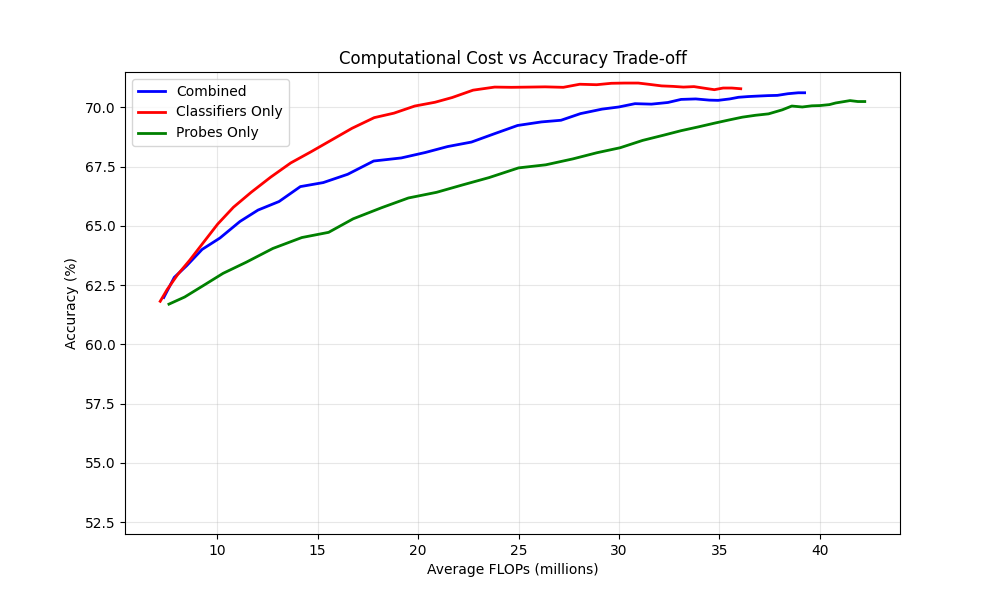

Figure 1 illustrates the relationship between computational cost (measured in FLOPs) and classification accuracy.
All approaches show diminishing returns in accuracy as computational cost increases.
The classifier-based approach shows rapid initial accuracy gains, reaching approximately 70% accuracy at 20M FLOPs, but exhibits diminishing returns thereafter. This behavior suggests that traditional confidence-based exit decisions effectively identify "easy" samples that can be classified correctly with minimal computation.

In contrast, the probe-based approach shows more gradual improvement in accuracy as computational resources increase, ultimately achieving comparable final accuracy (~70%) but requiring substantially more FLOPs. This may reflect the probes' focus on estimating computational uncertainty rather than immediate classification performance.

The combined approach presents an interesting middle ground, initially tracking closer to the classifier-based curve but showing more sustained improvement with increased computation. This suggests that integrating both uncertainty types helps balance immediate performance with reliable uncertainty estimation.

**Calibration Performance**

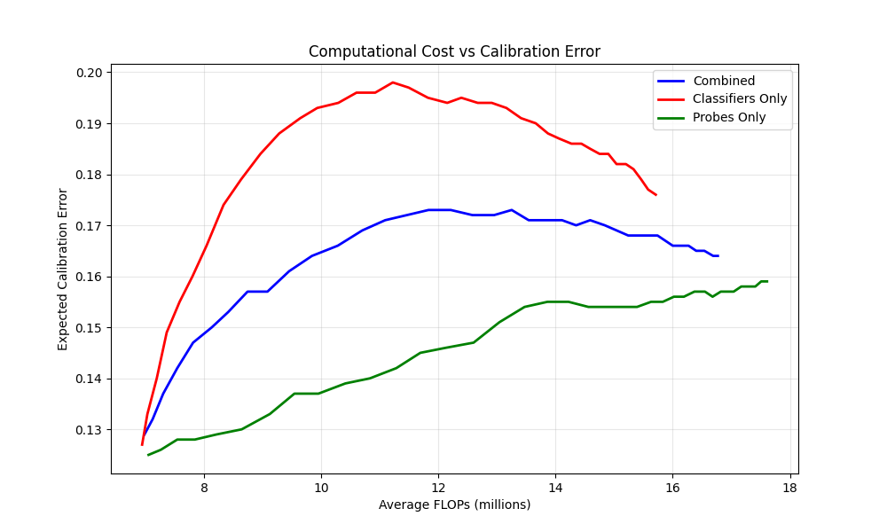

Figure 2 provides insights about the calibration properties of each approach through their Expected Calibration Error (ECE) curves. The probe-based method maintains the lowest ECE across the computational budgets and shows relatively stable behavior. This suggests that computational uncertainty estimates from probes provide more reliable confidence scores, and it seems that the probes are better at knowing "when they don't know”.
The classifier-based approach shows the highest calibration error, with a tendency toward overconfidence in its predictions. This aligns with known limitations of softmax-based confidence estimates in neural networks. The combined approach achieves intermediate calibration performance, suggesting that incorporating probe information helps with calibration.

**Exit Behavior Analysis**

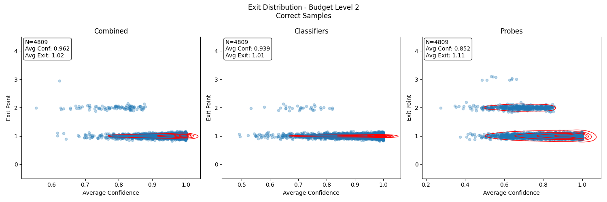
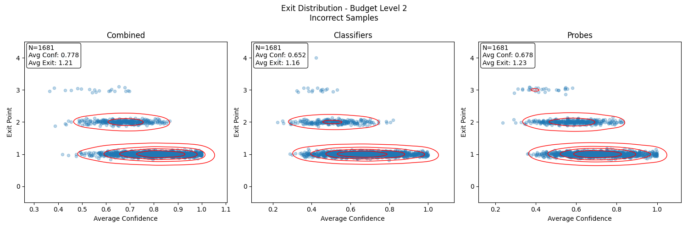

*Figure 3: Exit patterns and confidence distributions for consistently predicted samples (on all 4 exit points) for a low-resource scenario (Budget Level 2). Up: Correctly Classified data piints. Down: Incorrectly Classified data points.*

To understand how different uncertainty estimation methods behave under varying computational constraints, we analyze the exit patterns at two distinct budget levels: Budget Level 2 (Figure 3) and Budget Level 39 (Figure 4).

**Low-Resource Scenario (Budget Level 2)**
For correctly classified samples, the combined approach shows the highest average confidence (0.962) with minimal computational overhead (avg. exit: 1.02). The classifier-based method exhibits similar behavior (conf: 0.939, avg. exit: 1.01) with strong preference for early exits. Probe-based approach demonstrates more conservative behavior (conf: 0.852, avg. exit: 1.11) with a broader distribution of exit points.
For incorrect predictions, all methods show markedly lower confidence (0.652-0.778). Exit patterns concentrate primarily in the first two exit points. The probe-based approach shows slightly higher average exit points (1.23) compared to classifiers (1.16). The combined approach achieves better balance between confidence and exit point distribution.

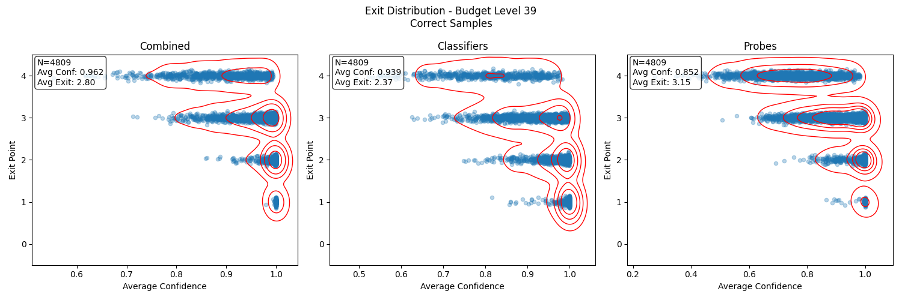
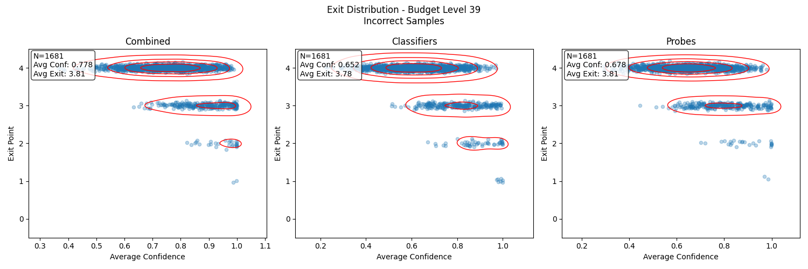

*Figure 4: Exit patterns and confidence distributions for consistently predicted samples (on all 4 exit points) for a high-resource scenario (Budget Level 39). Left: Correctly Classified data points. Right: Incorrectly Classified data points.*

**High-Resource Scenario (Budget Level 39)**
For correct predictions, there is a significant shift toward later exits across all methods. The probe-based approach shows the highest average exit point (3.15) compared to classifiers (2.37). The combined method achieves intermediate behavior (avg. exit: 2.80). Confidence patterns remain similar to low-resource scenario but with more distinct exit point clusters.
For incorrect predictions, all methods show strong preference for later exits (avg. exits: 3.78-3.81). The combined approach maintains higher average confidence (0.778) compared to individual methods. There is more pronounced separation between exit points, particularly in the probe-based method. There is additionally a clear tendency to exhaust available computational resources before making final predictions.

These patterns suggest that the probe-based approach is more cautious in its exit decisions, preferring to continue computation when uncertainty exists about the final prediction, particularly in the high-resource scenario. This behavioral difference can account for both the higher computational costs and better calibration properties observed in the aggregate performance metrics.

Overall, the combination of classifier predictions with probe-based confidence appears to offer a better balance between accuracy and calibration than either approach alone. This suggests that while probes might be better at uncertainty estimation, the classifier's predictions are still valuable for the final decision.

Regarding our initial hypothesis, we get a partial confirmation, in the sense that, the lower calibration error of the probes suggests they are indeed better at estimating uncertainty. However, the more gradual accuracy improvement with probes suggests they're making more informed decisions about when to exit.
An interesting deviation from our expectations is that the sample behavior plots don't show a clear pattern of earlier exits for high-uncertainty samples. 

# 6. Discussion and Conclusion

The results suggest different optimal approaches depending on deployment constraints: for computation-constrained environments, the classifier-based approach provides the best accuracy/FLOP trade-off in the low-computation regime; for reliability-critical applications, the probe-based approach offers superior calibration and more conservative exit behavior. Finally, the combined approach provides a reasonable compromise between computational efficiency and reliability.

These preliminary findings highlight the importance of computational uncertainty in early-exit networks and demonstrate that different uncertainty estimation methods lead to distinctly different behavioral patterns in the network's exit decisions. The findings are in line with prior research outputs that have integrated more than one sources of uncertainty, such as distributional or computational uncertainty alongside aleatoric and epistemic ones ( [[23]](#23), [[17]](#17), [[14]](#14) ) with distribution uncertainty) which point to the conclusion that a more accurate capturing of the model’s uncertainty can lead to improved (generalisation) performance and calibration.   

# References

<a id="1">[1]</a> Kaplan, J., McCandlish, S., Henighan, T., Brown, T. B., Chess, B., Child, R., ... & Amodei, D. (2020). Scaling laws for neural language models. arXiv preprint arXiv:2001.08361.

<a id="2">[2]</a> Snell, C., Lee, J., Xu, K., & Kumar, A. (2024). Scaling llm test-time compute optimally can be more effective than scaling model parameters. arXiv preprint arXiv:2408.03314.

<a id="3">[3]</a> Liu, Z., Lin, Y., Cao, Y., Hu, H., Wei, Y., Zhang, Z., ... & Guo, B. (2021). Swin transformer: Hierarchical vision transformer using shifted windows. In Proceedings of the IEEE/CVF international conference on computer vision (pp. 10012-10022).

<a id="4">[4]</a> Xu, X., Ding, Y., Hu, S. X., Niemier, M., Cong, J., Hu, Y., & Shi, Y. (2018). Scaling for edge inference of deep neural networks. Nature Electronics, 1(4), 216-222.

<a id="5">[5]</a> Strubell, E., Ganesh, A., & McCallum, A. (2020, April). Energy and policy considerations for modern deep learning research. In Proceedings of the AAAI conference on artificial intelligence (Vol. 34, No. 09, pp. 13693-13696).

<a id="6">[6]</a> Schwartz, R., Stanovsky, G., Swayamdipta, S., Dodge, J., & Smith, N. A. (2020). The right tool for the job: Matching model and instance complexities. arXiv preprint arXiv:2004.07453.

<a id="7">[7]</a> Teerapittayanon, S., McDanel, B., & Kung, H. T. (2016, December). Branchynet: Fast inference via early exiting from deep neural networks. In 2016 23rd international conference on pattern recognition (ICPR) (pp. 2464-2469). IEEE.

<a id="8">[8]</a> Huang, G., Chen, D., Li, T., Wu, F., Van Der Maaten, L., & Weinberger, K. Q. (2017). Multi-scale dense networks for resource efficient image classification. arXiv preprint arXiv:1703.09844.

<a id="9">[9]</a> Guo, C., Pleiss, G., Sun, Y., & Weinberger, K. Q. (2017). On calibration of modern neural networks. In Proceedings of the 34th International Conference on Machine Learning (ICML), volume 70 of Proceedings of Machine Learning Research, pages 1321–1330. PMLR.

<a id="10">[10]</a> Hein, M., Andriushchenko, M., & Bitterwolf, J. (2019). Why ReLU networks yield high-confidence predictions far away from the training data and how to mitigate the problem. In Proceedings of the IEEE Conference on Computer Vision and Pattern Recognition (CVPR), pages 41–50.

<a id="11">[11]</a> Kendall, A., & Gal, Y. (2017). What uncertainties do we need in Bayesian deep learning for computer vision? In Advances in Neural Information Processing Systems 30 (NIPS), pages 5574–5584. Curran Associates, Inc.

<a id="12">[12]</a> Kristiadi, A., Hein, M., & Hennig, P. (2020, November). Being bayesian, even just a bit, fixes overconfidence in relu networks. In International conference on machine learning (pp. 5436-5446). PMLR.

<a id="13">[13]</a> Han, Y., Huang, G., Song, S., Yang, L., Wang, H., & Wang, Y. (2022). Dynamic neural networks: A survey. IEEE Transactions on Pattern Analysis and Machine Intelligence, 44(11):7436–7456.

<a id="14">[14]</a> Wenger, J., Pleiss, G., Pförtner, M., Hennig, P., & Cunningham, J. P. (2022). Posterior and computational uncertainty in gaussian processes. Advances in Neural Information Processing Systems, 35, 10876-10890.

<a id="15">[15]</a> Kaya, Y., Hong, S., & Dumitras, T. (2019, May). Shallow-deep networks: Understanding and mitigating network overthinking. In International conference on machine learning (pp. 3301-3310). PMLR.

<a id="16">[16]</a> Jazbec, M., Allingham, J., Zhang, D., & Nalisnick, E. (2024). Towards anytime classification in early-exit architectures by enforcing conditional monotonicity. Advances in Neural Information Processing Systems, 36.

<a id="17">[17]</a> Meronen, L., Trapp, M., Pilzer, A., Yang, L., & Solin, A. (2024). Fixing overconfidence in dynamic neural networks. In Proceedings of the IEEE/CVF Winter Conference on Applications of Computer Vision (pp. 2680-2690).

<a id="18">[18]</a> Zilberstein, S. (1996). Using anytime algorithms in intelligent systems. AI magazine, 17(3), 73-73.

<a id="19">[19]</a> Metod Jazbec, James Allingham, Dan Zhang, and Eric Nalisnick. Towards anytime classification in early-exit architectures by enforcing conditional monotonicity. Advances in Neural
Information Processing Systems, 2024.

<a id="20">[20]</a> Phuong, M., & Lampert, C. H. (2019). Distillation-based training for multi-exit architectures. In Proceedings of the IEEE/CVF international conference on computer vision (pp. 1355-1364).

<a id="21">[21]</a> Hüllermeier, E., & Waegeman, W. (2021). Aleatoric and epistemic uncertainty in machine learning: An introduction to concepts and methods. Machine learning, 110(3), 457-506.

<a id="22">[22]</a> Gal, Y. (2016). Uncertainty in deep learning.

<a id="23">[23]</a> Malinin, A., & Gales, M. (2018). Predictive uncertainty estimation via prior networks. Advances in neural information processing systems, 31.

# Appendix

## A. Heteroscedastic formulation

An extension to the framework presented in Section 3.1 involves making the computational uncertainty heteroscedastic. Instead of using a fixed $\lambda_\ell^2$, we can make it input-dependent:

$p\_\ell(y_L|y, x^\*) = \mathcal{N}(y, \lambda_\ell^2(x^\*))$

This heteroscedastic extension aligns with the broader principle that uncertainty should be input-dependent when the difficulty of prediction varies across the input space. Just as heteroscedastic aleatoric uncertainty allows the model to express varying levels of observation noise for different inputs [[14]](#14) (like having higher uncertainty for poorly-lit images in computer vision tasks), heteroscedastic computational uncertainty enables the model to express varying levels of computational requirements. For instance, in image classification, a clear image of a common object might require less computation (and thus have lower computational uncertainty) than a blurry image of a rare object.

Wanger et al. ([[14]](#14)) account for the computational uncertainty resulting from approximation errors by by providing a methodology on Gaussian Processes that iteratively refines an approximated result with incremental corrections of an initially intractable computation problem based on multiple intermediate solutions. This, in our context, could be conceptually represented as each intermediate classification of the dynamic neural network (which, when combined gives a richer predictive distribution that takes into account the fact that exiting at previous blocks might lead to a non perfect value of the current one, as is further explored and shown in our results). However, in EENNS the uncertainty we model isn't over any model weight approximation or parameters nor in the task definition, but is a representation of properties intrinsic of dynamic or adaptive architectures.

## B. Confidence Trajectories

    

        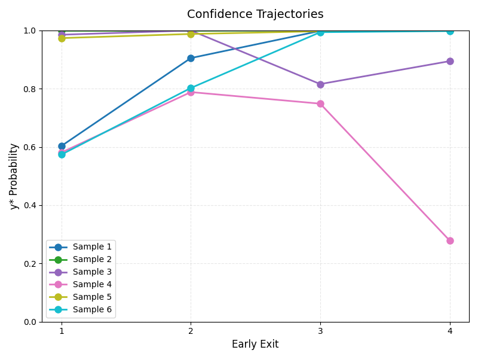
        
<b>(a) Classifiers</b>: Confidence trajectories of classifiers.

    

    

        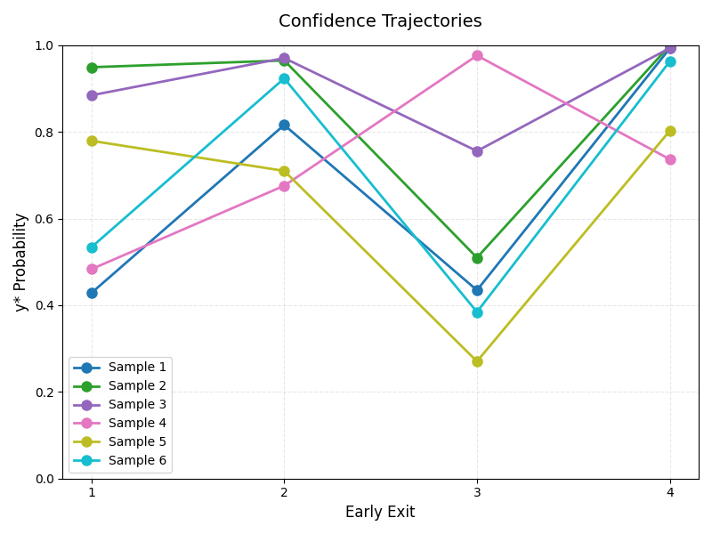
        
<b>(b) Probes</b>: Confidence trajectories of probes.

    

    

        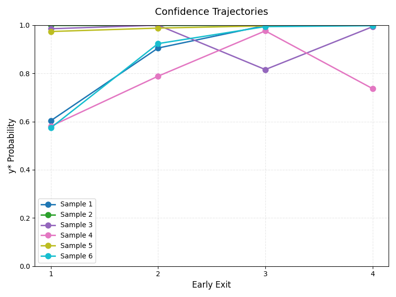
        
<b>(c) Combined</b>: Confidence trajectories of combined model that merges both confidences.

    

The distinct trajectory patterns between classifiers and probes provide some evidence towards the hypothesis that the two approaches are capturing fundamentally different aspects of predictive uncertainty.
The classifier's more smooth and relatively monotonic progression contrasts with the probes trajectories. The latter seem to be able to identify potential prediction instabilities, particularly evident at exit point 3. 
These observed trends support the hypothesis that combining both approaches may provide a more comprehensive uncertainty quantification framework, potentially leading to more reliable early exit decisions in practical applications.

## C. Exit Distributions

    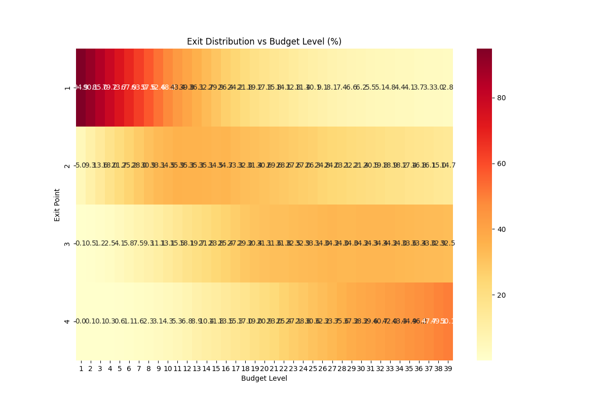
    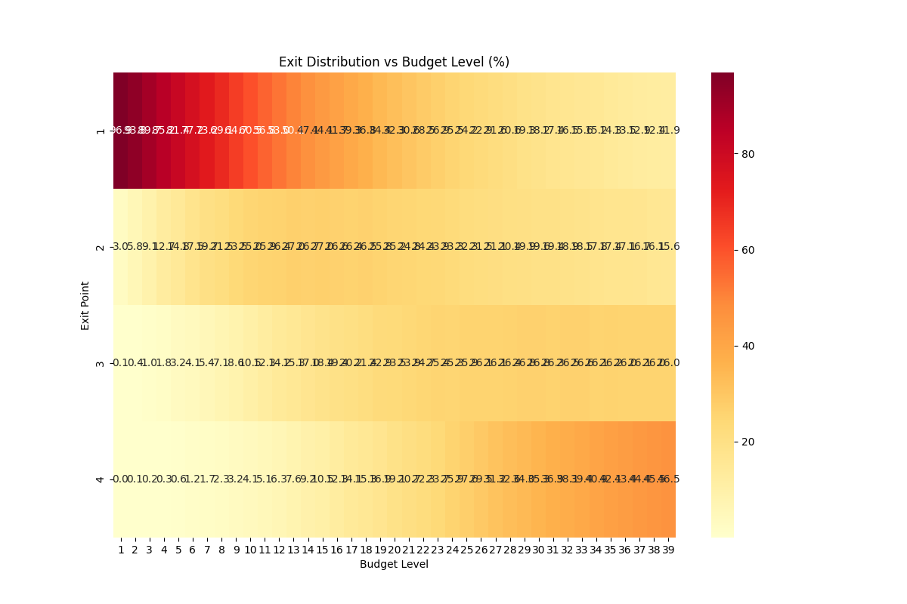
    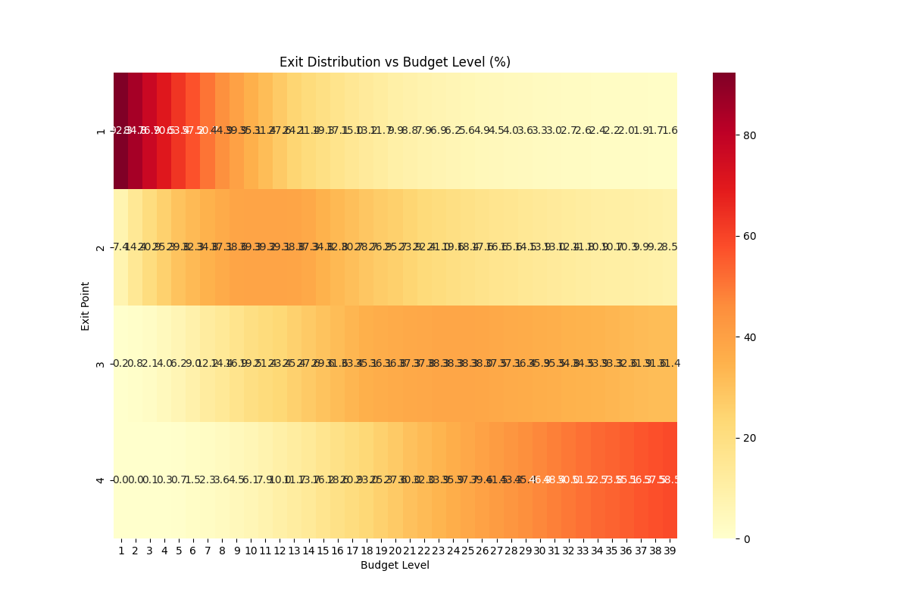

## D. Fixed Threshold comparisons

    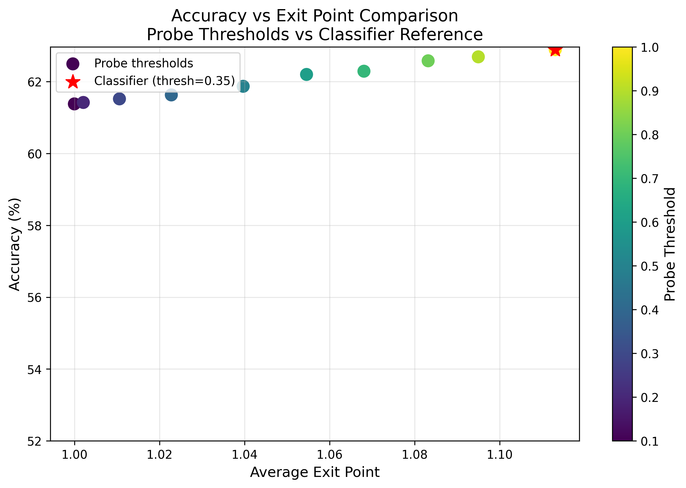
    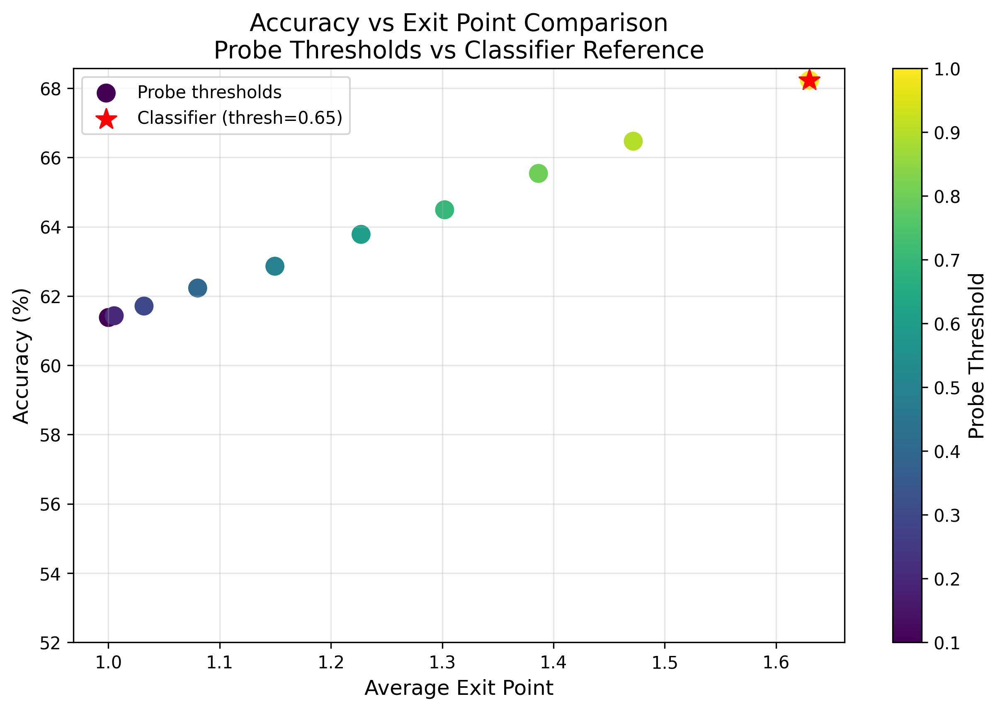
    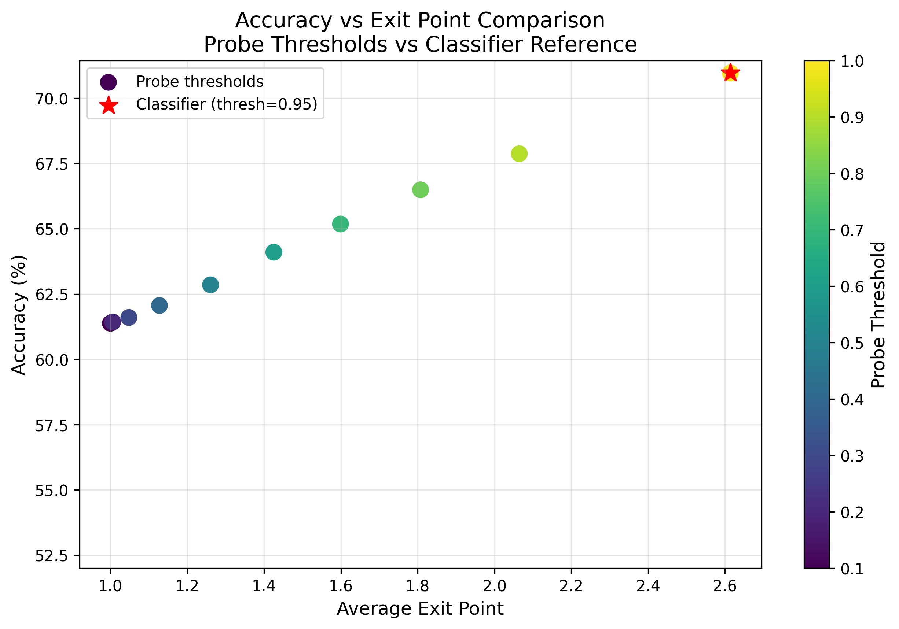

    

        
        
<b>(a) Classifier Thresh=0.35</b>

    

    

        
        
<b>(b) Classifier Thresh=0.65</b>

    

    

        
        
<b>(c) Classifier Thresh=0.95</b>

    

<!-- 

 -->

In this supplementary experiment, we substituted the budgeted classification task using dynamic thresholds with a simple classification task using fixed thresholds. Effectively, the full budget available is used, but by fixing the confidence thresholds at three distinct values in order to simulate low-, middle- and high-budget scenarios. The goal is to test whether, for a given classifier threshold, it is possible to surpass the accuracy or the efficiency of a classifier-only model (the red star point) by using a combined uncertainty model. For each of the three classifier thresholds, 10 combined models were tested using incrementally higher confidence thresholds in the range [0.1, 1].

We observe that no model outperforms the classifier model. In fact, integrating computational uncertainty hurts performance almost in a linear way as the combined model's confidence threshold is reduced. 

However in the "low-budget" simulated scenario we see that the performance losses are minimal, while the efficiency is greatly increased, as indicated by the smaller average exit point. 

The relationship between accuracy degradation and computational efficiency gains is non-uniform across threshold regimes. Low-threshold scenarios present the most favorable trade-off, suggesting optimal deployment conditions for probe-based approaches.

This also poses an interesting direction for future research, investigating whether it is possible to emulate the trends observed in figure (a) for higher classifier's confidence thresholds.

